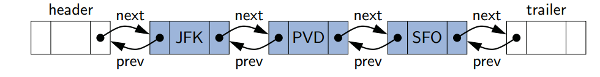

# Doubly Linked Lists

**In a singly linked list, each node maintains a reference to the node that is immediatedly after it. But we cannot efficiently delete an arbitrary node from an interior position of the list if only given a reference to that node, because we cannot determine the node that immediately precedes the node to be deleted(yet, that node needs to have its next reference updated).**

***To provide greater symmetry, we define a linked list in which each node keeps an explicit reference to the node before it and a reference to the node after it. Such a structure is known as a ___doubly linked list.***

# Header and Trailer Sentinels

**In order to avoid some special cases when operating near the boundaries of a doubly linked list, it helps to add special nodes at both ends of the list: a header node at the beginning of the list, and a trailer node at the end of the list. These "dummy" nodes are known as sentinels(or guards), and they do not store elements of the primary sequence.**



**When using sentinel nodes, an empty list is intialized so that the next filed of the header points to the trailer, and the prev filed of the trailer points to the header; the remaining fields of the sentinels are irrelevant(presumably null). For a nonempty list, the header's ___next___ will refer to a node containning the first real element of a sequence, just as the trailer's ___prev___ references the node containning the last element of a sequence.**

# Advantage of Using Sentinels

**Although we could implement a doubly linked list without sentinel nodes, the slight extra memory devoted to the sentinels greatly simplifies the logic of our operations. Most notably, the header and trailer nodes never change -- only the nodes between them change. Furthermore, we can treat all insertions in a unifed manner, because a new node will always be placed between a pair of existing nodes. In similar fashion, every element that is to be deleted is guaranteed to be stored in a node that has neighbors on each side.**

# Suppoted interface

```Java
    size();
    isEmpty();
    first();
    last();
    addFirst();
    addLast();
    removeFirst();
    removeLast();
```

# implementation in Java

```Java
    public class DoublyLinedList<E> {
        private static class Node<E> {
            private E element;
            private Node<E> prev;
            private Node<E> next;
            public Node(E e, Node<E> p, Node<E> n) {
                element = e;
                prev = p;
                next = n;
            }

            public E getElement() { return element; }
            public Node<E> getPrev() { return prev; }
            public Node<E> getNext() { return next; }
            public void setPrev(Node<E> p) { prev = p; }
            public void setNext(Node<E> n) { next = n; }
        }

        private Node<E> header;
        private Node<E> trailer;
        private int size = 0;
        
        public DoublyLinkedList() {
            header = new Node<> (null, null, null);
            trailer = new Node<>(null, header, null);
            header.setNext(trailer);
        }

        public int size() { return size; }

        public boolean isEmpty() { return size == 0; }

        public E first() {
            if (isEmpty()) return nil;
            return header.getNext().getElement();
        }

        public E last() {
            if (isEmpty()) return nil;
            return trailer.getPrev().getElement();
        }

        public void addFirst(E e) {
            addBetween(e, header, header,getNext());
        }

        public void addLast(E e) {
            addBetween(e, trailer.getPrev(), trailer);
        }

        public E removeFirst() {
            if (isEmpty()) return nil;
            return remove(header.getNext());
        }

        public E removeLast() {
            if (isEmpty()) return nil;
            return remove(trailer.getPrev);
        }

        private void addBetween(E e, Node<E> predecessor, Node<E> successor) {
            Node<E> newest = new Node<>(e, predecessor, successor);
            predecessor.setNext(newest);
            successor.setPrev(newest);
            size++;
        }

        private E remove(Node<E> node) {
            Node<E> predecessor = node.getPrev();
            Node<E> successor = node.getNext();
            predecessor.setNext(successor);
            successor.setPrev(predecessor);
            size--;
            return node.getElement();
        }
    }
```
