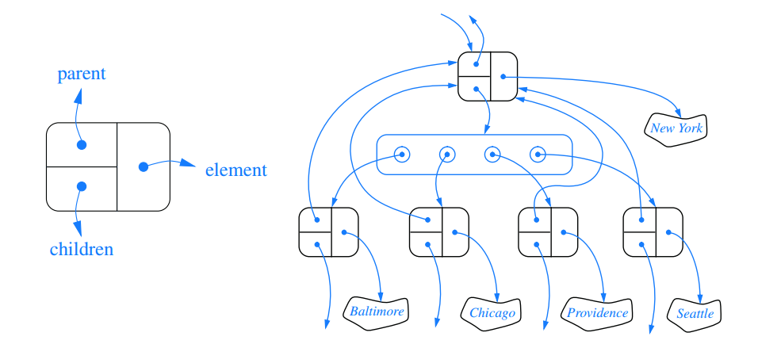

# Tree
**A tree is an abstract data type that stores elements hierarchically. With the exception of the top element, each element in a tree has a ___parent___ element and zero or more ___children___ elements. We typically call the top element the ___root___ of the tree.**

# Formal Tree Definition

**Formally, we define a tree T as a set of nodes storing elements such that the nodes have a parent-child relationship that satisfies the following properties.:**

1. If T is noneempty, it has a special node, called the root of T, that has no parent.
2. Each node v of T different from the root has a unique parent node w; every node with parent w is a child of w.

**Note that according to our definition, a tree can be empty, meaning that it does not have any nodes. This convention also allows us to define a tree recursively such that a tree T is either empty or consists of a node r, called the root of T, and a (possibly empty) set of subtrees whose roots are the children of r.**

**Twe nodes that are children of the same parent are ___siblings___. A node v is ___external___ if v has no children. A node v is ___internal___ if it has one more children. External nodes are also known as ___leaves___.**

**A node ___u___ is an ___ancestor___ or a node ___v___ if ___u___ == ___v___ or ___u___ is an ancestor of the parent of ___v___. Conversely, we say that a node ___v___ is a ___descendant___ of a node ___u___ if ___u___ is an ancestor of ___v___.**
**The ___subtree___ of T ___rooted___ at a node v is the tree consisting of all the descendants of ___v___ in ___T___ (including ___v___ itself).**

# Edeges and Path in Trees

**An ___edge___ of tree ___T___ is a pair of nodes ___(u, v)___ such that ___u___ is the parent of ___v___, or vice versa. A ___path___ of ___T___ is a sequence of nodes such that any two consecutive nodes in the sequece form an edge.**

# Ordered Trees

**A tree is ___ordered___ if there is a meaningful order among the children of each node; that is, we purposefully identify the children of a node as being the first, second, third, and so on. Such an order is usually visualized by arranging siblings left to right, according to their order.**

# The tree Abstract Data Type

**We define a tree ADT using the concept of a ___position___ as an abstraction for a node of a tree. An element is stored at each position, and positions satify parent-child relationships that define the tree structure.**
**Let ___p___ be a postion within tree ___T___, The depth of ___p___ is the number of ancestors of ___p___, other than ___p___ itself. Not that this definition implies that the depth of the root of ___T___ is 0. The depth of ___p___ can also be recursively defined as follows:
    1. If ___p___ is the root,  then the depth of ___p___ is 0.
    2. Otherwise, the depth of ___p___ is one plus the depth of the parent of ___p___.**
**We define the ___height___ of a tree to be equal to the maxmimum of the depths of its positions(or zero, if the tree is empty).  It is easy to see that the position with maximum depth must be a leaf.**
**We define the ___height___ of a ___position p ___ of in a tree ___T___ as follows:
    1. If p is leaf, then the height of p is 0.
    2. Otherwise, the height of p is one more than the maximum of the heights of ___p___'s children.**

**A position object for a tree support the method:**
```Java
    getElement(): Returns the element stored at this position.
```
**The tree ADT then supports the following accessor methods, allowing a user to naviagte the various postions of a tree T:**
```Java
    root();
    parent(p);
    children(p): Return an iterable collection containing the children of position p (if any).
    numChildren(p);
```
> If a tree ___T___ is ordered, then children(p) reports the children of p in order.

**In addition to the above fundamental accessor methods, a tree supports the following query methods:**
```Java
    isInternal(p);
    isExternal(p);
    isRoot();
```
**Trees support a number of more general methods, unrelated to the specific structure of the tree. These include:**
```Java
    size();
    isEmpty();
    iterator();
    positions();
```

**We do not define any methods for creating or modifying trees at this point. We prefer to describe different tree update methods in conjunction with specific implementations of the tree interface, and specific applications of trees.**

```Java
    public interface Tree<E> extends Iterable<E> {
        Position<E> root();
        Position<E> parent(Position<E> p) throws IllegallArgumentException;
        Iterable<Position<E>> children(Position<E> p) throws IllegallArgumentException;
        int numbChildren(Position<E> p) throws IllegallArgumentException;
        boolean isInternal(Position<E> p) throws IllegallArgumentException;
        boolean isExternal(Position<E> p) throws IllegallArgumentException;
        boolean isRoot(Position<E> p) throws IllegallArgumentException;
        int size();
        boolean isEmpty();
        Iterator<E> iterater();
        Iterable<Position<E>> positions():
    }

    public abstract class AbstractTree<E> implenments Tree<E> {
        public boolean isInternal(Position<E> p) { return numChildren(p) > 0; }
        public boolean isExternal(Position<E> p) { return numChildren(p) == 0; }
        public boolean isRoot(Position<E> p) { return p == root(); }
        public boolean isEmpty() { return size() == 0; }
        public int depth(Position<E> p) {
            if (isRoot(p))
                return 0;
            else
                return 1 + depth(parent(p));
        }

        private int heighBad() {
            int h = 0;
            for (Position<E> p : positions())
                if (isExternal(p))
                    h = Math.max(h, depth(p));
            return h;
        }

        public int height(Position<E> p) {
            int h = 0;
            for (Position<E> c : children(p)) 
                h = Math.max(h, 1+height(c));
            return h;
        }
    }
```


# Binary Trees
**A binary tree is an ordered tree with the following properties:
    1. Every node has at most two children.
    2. Each child node is labeled as being either a ___left child___ or a ___right child___.
    3. A left child precedes a right child in the order of children of a node.
The  subtree rooted at a left or right child of an internal node ___v___ is called a ___left subtree___ or ___right subtree___, respectively, of ___v___. A binary tree is ___proper___ if each node has either zero or two children. Some people also refer to such trees as being full binary trees. Thus,  in a proper binary tree, every internal node has exactly two children. A binary tree that is not proper is ___improper___.**

# A recursive Binary Tree Definition

**Incidentally, we can also deifne a binary tree in recursive way. In that case, a binary tree is either:
    1. An empty tree.
    2. A nonempty tree having a root node ___r___, wihch stores an element, and two binary trees that are respectively the left and right subtrees of ___r___. We note taht one or both of those subtrees can be empty by this definition.**

# The binary Tree Abstract Data Type
```Java
    left(p);
    right(p);
    sibling(p);
```
**We do not define specialized update method for binary trees here. Instead, we'll consider some possible update methods when we describe specific implementations and applications of binary trees.**

# Defining a Binary Tree Interface
```Java
    public interface BinaryTree<E> extends Tree<E> {
        Position<E> left(Position<E> p) throws IllegallArgumentException;
        Position<E> right(Position<E> p) throws IllegallArgumentException;
        Position<E> sibling(Position<E> p) throws IllegallArgumentException;
    }

    public abstract class AbstractBinaryTree<E> extends AbstractTree<E>
                                                implements BinaryTree<E> {
        public Position<E> sibling(Position<E> p) {
            Position<E> parent = parent(p);
            if (parent == null) return null;
            if (p == left(parent) return right(parent);
            else return left(parent);
        }

        public int numChildren(Position<E> p) {
            int count = 0;
            if (left(p) != null)
                count++;
            
            if (right(p) != null)
                count++;

            return count;
        }

        public Iterable<Position<E>> children(Position<E> p) {
            List<Position<E>> snapshot = new ArrayLIst<>(2);
            if (left(p) != null)
                snapshot.add(left(p));
            if (right(p) != null)
                snapshot.add(right(p));
            return snapshot;
        }
    }                                                
```

# Implementing Trees

**There are several choices for the internal representation of trees.**

## Linked Structrue for Binary Trees
**A natural way to realize a binary tree ___T___ is to use a ___linked structure___, with a node that maintains references to the element stored at a position ___p___ and to the nodes associated with the children and parent of ___p___.**
**If ____p____ is the root of T, then the parent field of ___p___ is null. Likewise, if ___P___ does not have a left child (respectively, right child), the associated filed is null. The tree itself maintains an instance variable storing a reference to the root node(if any), and a variable, called size, that represents the overall number of nodes of T.**

**For a linked binary tree, we suggest that the following upate methods be supported:**
```Java
    addRoot(e): //Create a root for an empty tree.
    addLeft(p, e);
    addRight(p, e);
    set(p, e);
    attach(p, T1, T2): // Attaches the internal structure of trees T1 and T2 as the respective left and right subtrees of leff position p and reset T1 and T2 to empty trees.
    remove(p);
```

```Java
    public class LinkedBinaryTree<E> extends AbstractBinaryTree<E> {
        protected static class Node<E> implements Position<E> {
            private E element;
            private Node<E> parent;
            private Node<E> left;
            private NOde<E> right;

            public Node(E e, Node<E> above, Node<E> leftChild, Node<E> rightChild) {
                element = e;
                parent = above;
                left = leftChild;
                right = rightChild;
            }

            public E getElement() { return element; }
            public Node<E> getParent() { return parent; }
            public Node<R> getLeft() { return left; }
            public Node<E> getRight() { return right; }

            public void setElement(E e) { element = e; }
            public void setParent(Node<E> parentNode) { parent = parentNode; }
            public void setLeft(Node<E> leftChild) { left = leftChild; }
            public void setRight(Node<E> rightChild) { right = rightChild; }
        }

        protected Node<E> createNode(E e, Node<E> parent, Node<E> left, Node<E> right) {
            return new Node<E> (e, parent, left, right);
        }

        protected Node<E> root = null;
        private int size = 0;
        public LinkedBinaryTree() {}

        protected Node<E> validate(Position<E> p) throws IllegallArgumentException {
            if (!(p instanceof Node))
                throw new IllegallArgumentException("Not valid position type");

            Node<E> node = (Node<E>) p;
            if (node.getParent() == node)
                throw new IllegallArgumentException("p is no longer in the tree");
            return node;
        }

        public int size() {
            return size;
        }

        public Position<E> root() {
            return root;
        }

        public Position<E> parent(Position<E> p) throws IllegallArgumentException {
            Node<E> node = validate(p):
            return node.getParent();
        }

        public Postion<E> left(Position<E> p) throws IllegallArgumentException {
            Node<E> node = validate(p);
            return node.getLeft();
        }

        public Position<E> right(Position<E> p) throws IllegallArgumentException {
            Node<E> node = validate(p);
            return node.getRight();
        }

        public Position<E> addRoot(E e) throws IllegallArgumentException {
            if (!isEmpty()) throw new IllegallArgumentException("Tree is not empty");
            root = createNode(e, null, null, null);
            size = 1;
            return root;
        }

        public Position<E> addLeft(Position<E> p, E e) throws IllegallArgumentException {
            Node<E> parent  = validate(p);
            if (parent.getLeft() != null) throw new IllegallArgumentException("p already has a left child");
            Node<E> child = createNode(e, parent, null, null);
            parent.setLeft(child);
            size++;
            return child;
        }

        public Position<E> addRight(Position<E> p, E e) throws IllegallArgumentException {
            Node<E> parent = validate(p);
            if (parent.getRight() != null)
                throw new IllegallArgumentException("p already has a right child");
            Node<E> child = createNode(e, parent, null, null);
            parent.setRight(child);
            size++;
            return child;
        }

        public E set(Position<E> p, E e) throws IllegallArgumentException {
            Node<E> node = validate(p);
            E temp = node.getElement();
            node.setElement(e);
            return temp;
        }

        public void attach(Position<E> p, LinkedBinaryTree<E> t1, LinkedBinaryTree<E> t2) throws IllegallArgumentException {
            Node<E> node = validate(p);
            if(isInternal(p)) throw new IllegallArgumentException("P must be a leaf");
            size += t1.size() + t2.size();

            if (!t1.isEmpty()) {
                t1.root.setParent(node);
                node.setLeft(t1.root);
                t1.root = null;
                t1.size = 0;
            }

            if (!t2.isEmpty()) {
                t2.root.setParent(node);
                node.setRight(t2.root);
                t2.root = null;
                t2.size = 0;
            }
        }

        public E remove(Position<E> p) throws IllegallArgumentException {
            Node<E> node = validate(p);
            if (numChildren(p) == 2)
                throw new IllegallArgumentException("p has two children");
            Node<E> child = (node.getLeft() != null ? node.getLeft() : node.getRight());

            if (child != null)
                child.setParent(node.getParent());

            if(node == root)
                root = child;

            else {
                Node<E> parent = node.getParent();
                if (node == parent.getLeft())
                    parent.setLeft(child)
                else
                    parent.setRight(child)
            }
            size--;
            E temp = node.getElement();
            node.setElement(null);
            node.setRight(null);
            node.setLeft(null);
            node.setParent(null);
            return temp;
        }
    }
```

## Array Based Representation of a Binary Tree
**An alternative representation of a binary tree T is based on a way of numbering the positions of T. For every postition ___p___ of T, let ___f(p)___ be the interger defined as follows.
    1. If ___p___ is the root of T, then ___f(p)___ = 0.
    2. If ___p___ is the left child of position ___q___, then ___f(p)___ = 2___f(q)___ + 1.
    3. If ___p___ is the right child of position ___q___, then ___f(p)___ = 2___f(q)___ + 2.

The numbering function ___f___ is known as a ___level numbering___ of the positions in a binary tree T, for it numbers the position on each level of T in increasing order from left to right.**

**The level numbering function ___f___ suggests a representation of a binary tree ___T___ by means of an array-based structure A, with the element at position p of T stored at index ___f(p)___ of the arrary.**


## Linked Structure for General Trees
**When respresenting a bianry tree with a linked structure, each node explicitly maintains fields ___left___ and ___right___ as reference to individual children. For a general tree, there is no priori  limit on number of children that a node may have. A natural way to realize a greneral  tree ___T___ as a linked structure is to have each node store a single ___container___ or reference to its children. For example, a ___children___ filed of a node can be an array or list of references to the children of the node(if any).**



# Tree Traversal Algorithms
**A traversal of a tree ___T___ is a systematic way of accessing, or "visiting", all the positions of ___T___. The specific action associated with the "visit" of position ___p___ depends on the application of this traversal, and could involve anything from incrementing a counter to performing some complex computation for ___p___.** 

## Preorder and Postorder Traversals of General Trees
**In a preorder traversal of a tree ___T___, the root of ___T___ is visited first and then the subtrees rooted at its children are traversed recursively. If the tree is ordered, then the subtree are traversed according to the order of the children.**
```Java
    Algorithm preorder(p):
        perform the "visit" action for position p;
        for each child c in children(p) do
            preorder(c);
```


## Postorder Traversal
**Another important tree traversal algorithm is the ___postorder traversal___. In some sense, this algorithm can be viewed as the opposite of the preorder traversal, because it recursively traverses the subtrees  rooted at the children of the root first, and the vist the root(hence, the name "postorder").**
```Java
    Algorithm postorder(p):
        for each child c in children(p) do
            postorder(c);
        perform the "visit" action for position p
```


## Breadth-First Tree Traversal
**Although the preorder and postorder traversals are common ways of visiting the positions of a tree, another approach is to traverse a tree so that we visit all the positions at depth ___d___ before we visit the positions at depth ___d___ + 1. Such an algorithm is known as a ___breadth-first traversal___.**
**A breadth-first traversal is a common approach used in software for playing games. A ___game tree___ represents the possible choices of moves that might be made by a player(or computer) during a game, with the root of the tree being the initial configuration for the game.**

### The process of breadth-first tree traversal is not recursive, since we are not traversing entire subtree at once. We use queue to produce a FIFO(i.e., first-in first-out) sematics for the order in which we visit nodes. The overall running time is __O(n)__, due to the __n__ calls to enqueue and __n__ calls to dequeue.

```Java
    Algorithm breadthfirst():
        while Q not empty do
            p = Q.dequeue();
            perform the "visit" action for position p
            for each child c in children(p) do 
                Q.enqueue(c)
```

## Inorder Traversal of a Binary Tree
**The standard preorder, postorder, and breath-first traversals that were introduced for general trees can be directly applied to binary trees. For binary tree. There is another common traversal algorithm specifically for a binary tree.**
**During an ___indrder traversal___, we visit a position between the recursive traversals of its left and right subtrees. The inorder traversal of a binary tree ___T___ can be informally viewed as visiting the nodes of ___T___ "from left to right." Indeed, for every position ___p___, the inorder traversal visits ___p___ after all the positions in the left subtree of ___p___ and before all the positions in the right subtree of ___p___.**
```Java
    Algorithm inorder(p):
        if p has left child lc then
            inorder(lc);
        perform the "visit" action for position p;
        if p has right child rc then
            inorder(rc);
```


# Binary Search Tree
**An important application of the inorder traversal algorithm arises when we store an ordered sequence of elements in a binary tree, defining a structure we call a ___binary search tree___. Let S be a set whose unique elements have an order relation. For example, S should be a set of integers. A binary search tree for S is a proper binary tree ___T___ such that, for each internal position ___p___ of ___T___:
    1. Position ___p___ stores an element of ___S___, denoted as ___e(p)___.
    2. Elements stored in the left subtree of ___p___ (if any) are less then ___e(p)___.
    3. Elements stored in the right subtree of ___p___ (if any) are greater than ___e(p)___.**

